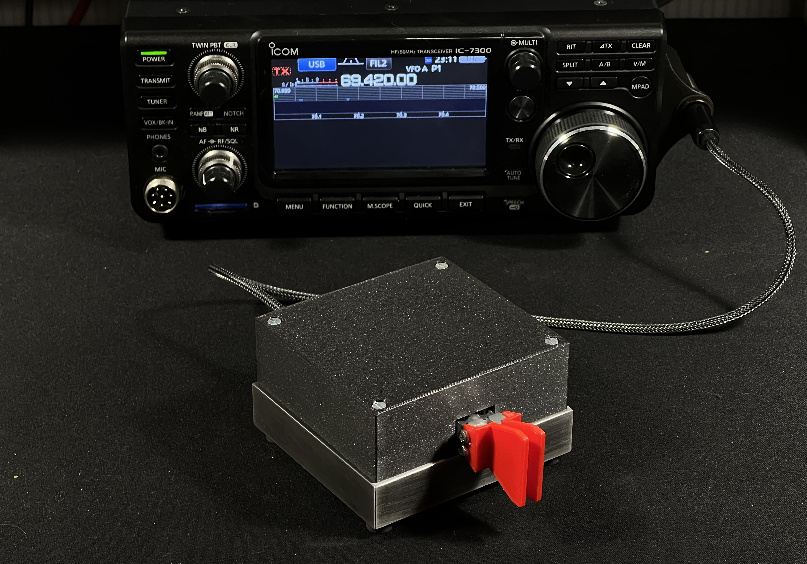
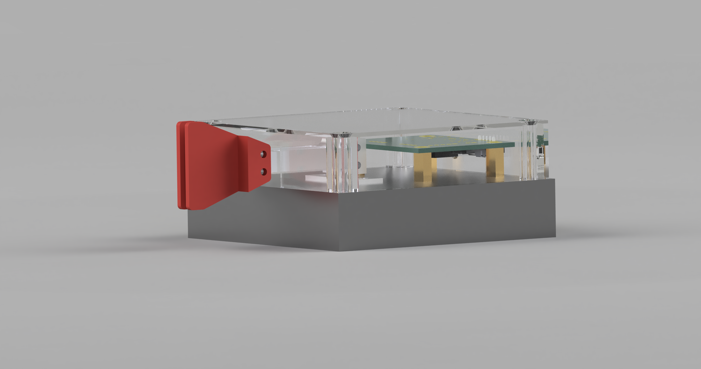
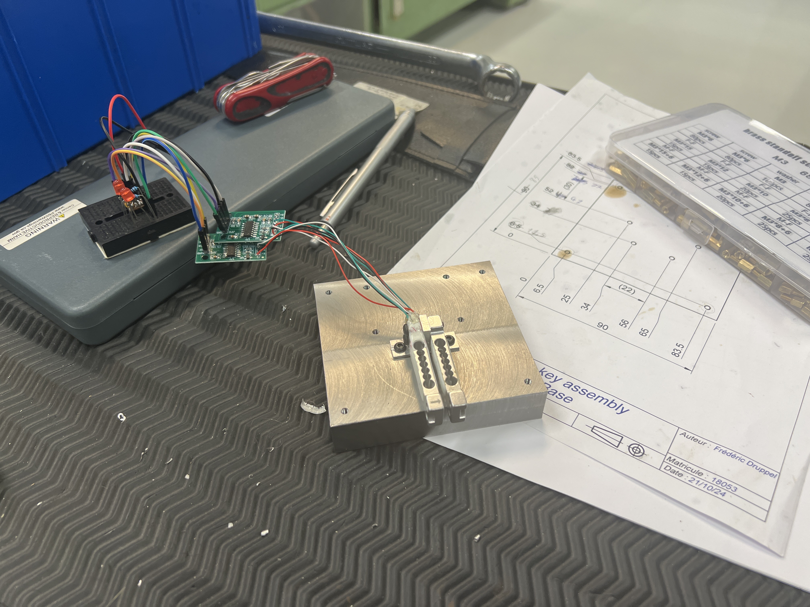
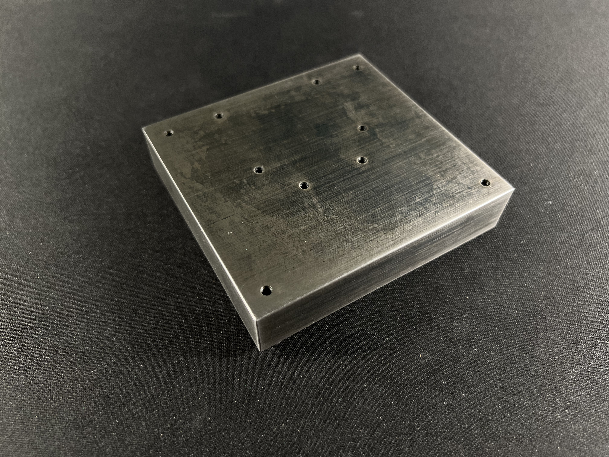
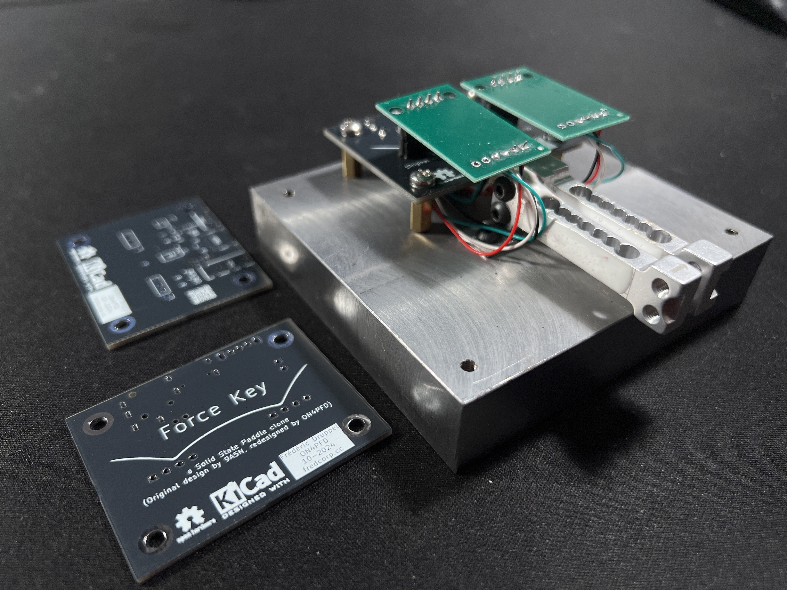
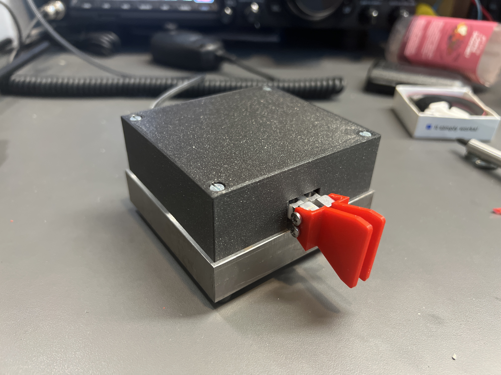
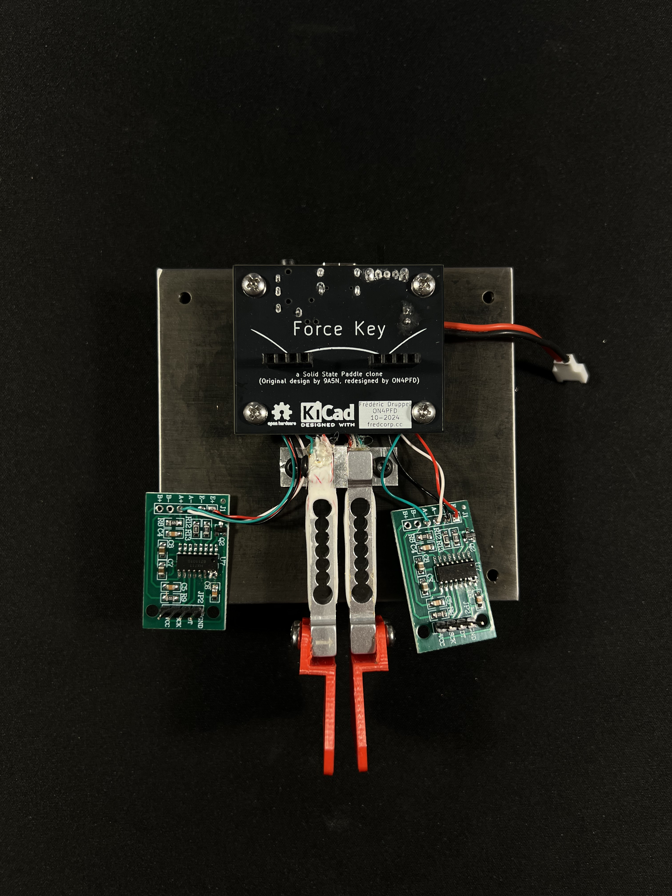

# Force Key

## Description

The Force Key solid-state morse paddle key, which, as the name implies, uses force senors (load cells) to detect the user's input. It is designed to work in single-lever mode or twin-lever mode.  
The output is a standard 3.5mm stereo jack, which can be connected to any morse keyer or transceiver.

## Features

- Single-lever or twin-lever mode, or both at the same time
- Adjustable sensitivity in code
- TRS 3.5mm stereo jack output (tip = dot, ring = dash, sleeve = ground)
- Li-Ion battery powered
- USB-C port for charging
- Uses cheap Puya microcontroller

## Hardware

- PCB & other components in BOM
- 2x [100g load cells + HX711 amplifier](https://fr.aliexpress.com/item/1005001537354199.html) (make sure to get the 100g version !)
- TODO: add more details

The HX711 has to be modded to output data at 80Hz rate, which is done by lifting pin 15 and bridging it to pin 16 :  

## Inspiration

The Force key is inspired by the [Solid State Paddle by 9A5N](https://www.9a5n.eu/paddle.html), which is a beautiful product; but because of my student budget, I decided to make my own version.  
It was a nice challenge as I wanted to use the Puya PY32F002A microcontroller, which is not very common in the maker community.  
I also wanted to machine the base and load cell supports myself, which was exciting as I don't get to use the mills and lathes of my university very often as I'm an EE student.

Please consider buying the original product if you can afford it, it's a great product and it's worth the price (thanks [F4IEY](https://github.com/f4iey) for showing it to me in the first place !).

## Pictures

### 3D Render from Autodesk Fusion

### Base machining

The final base ended up being 90x85x20mm due to the available scrap blank; the CAD was then adapted to fit the new dimensions.

It was amazing to be able to use the machines of my university. It took a whole afternoon to machine both parts (base and load-cell support), but it was really fun ! Thanks again to my teacher for all the help and advice.

### Base bluing

Before :  

After :  

After a lot of sanding with 180 and 320 scotch-brite, I used a cold bluing solution to give the base a nice black finish. It's not perfect nor uniform, but it gives a great old-school look to the base.

### Assembly

Partial assembly before bluing :  

Assembly before bluing :  

Partial assembly after bluing :

Final assembly :

## License & Acknowledgements

Made with ❤️, lots of ☕️, and lack of 🛌

  
[GNU GPLv3](https://www.gnu.org/licenses/gpl-3.0.en.html)
